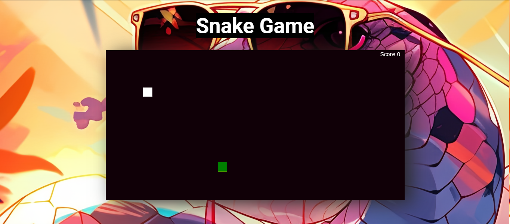
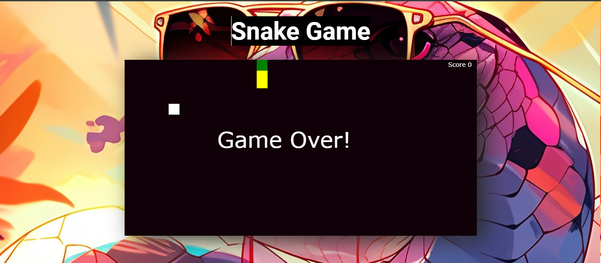

# Snake-Game
# One Player Game
"This project is an engaging rendition of the timeless Snake Game, created with HTML, CSS, and JavaScript. The game challenges players to control a snake, guiding it to consume food and grow longer. Featuring responsive design elements, the Snake Game delivers an immersive experience."
## "Once GameOver Refresh and Play again and again"

<h1 align="center">
  <a href="https://arnnab-snakegame.netlify.app/">🐍👉Live Demo👍🐍</a>
</h1>

## Screenshots

*Enjoy playing the Game! If you have any feedback or suggestions, feel free to reach out to me.*
